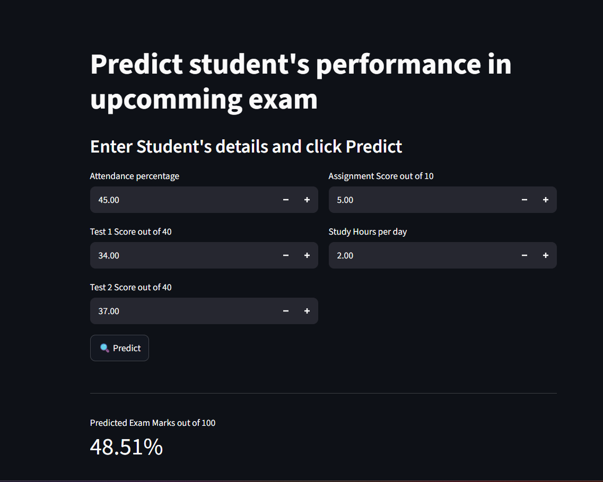

# 🎓 Student Performance Prediction

A Machine Learning-based application for predicting student academic performance using student-related academic and demographic information.

The project covers the complete Machine Learning workflow, including **data preprocessing, exploratory data analysis, feature engineering, model training, evaluation, and deployment through a web application**.

---

## 📌 Project Overview

Student academic performance can be influenced by various academic, personal, and demographic factors. The objective of this project is to build a Machine Learning system that can learn patterns from historical student data and generate predictions for student performance.

The project combines a trained Machine Learning model with a web-based interface, making it possible for users to provide student information and obtain a prediction.

---

## 🎯 Objectives

* Analyze student performance data.
* Perform exploratory data analysis (EDA).
* Clean and preprocess the dataset.
* Select relevant features for prediction.
* Train and evaluate Machine Learning models.
* Build a prediction system using the trained model.
* Provide an easy-to-use web interface.
* Integrate the Machine Learning model with a backend API.

---

## ✨ Key Features

* 📊 Exploratory Data Analysis
* 🧹 Data preprocessing and cleaning
* 🔎 Feature analysis and selection
* 🤖 Machine Learning model training
* 📈 Model evaluation
* ⚡ FastAPI backend
* 🖥️ Frontend prediction interface
* 🔮 Real-time student performance prediction
* 📁 Dataset included in the repository
* 📓 Jupyter Notebook for analysis and experimentation

---

## 🧠 Machine Learning Workflow

The project follows a standard Machine Learning pipeline:

```text
Student Dataset
      ↓
Data Collection
      ↓
Data Cleaning
      ↓
Exploratory Data Analysis
      ↓
Feature Engineering
      ↓
Train-Test Split
      ↓
Data Preprocessing
      ↓
Model Training
      ↓
Model Evaluation
      ↓
Best Model Selection
      ↓
FastAPI Backend
      ↓
Frontend Application
      ↓
Student Performance Prediction
```

---

## 🛠️ Technologies Used

### Programming Language

* Python

### Data Science & Machine Learning

* Pandas
* NumPy
* Scikit-learn
* XGBoost
* SciPy
* Joblib

### Data Visualization

* Matplotlib
* Seaborn

### Backend

* FastAPI
* Uvicorn

### Frontend / Application

* Streamlit

### Development & Analysis

* Jupyter Notebook
* Jupyter Kernel
* Git & GitHub

---

## 📂 Project Structure

```text
Student-performance-prediction/
│
├── backend/
│   └── Backend files and API implementation
│
├── frontend/
│   └── Frontend application
│
├── dataset/
│   └── Dataset files
│
├── notebook_file/
│   └── Jupyter Notebook
│
├── requirements.txt
│
├── .gitignore
│
└── README.md
```

---

## 📊 Dataset

The project uses a student performance dataset containing information related to students that can be used to identify patterns associated with academic performance.

The dataset is stored inside the:

```text
dataset/
```

directory.

The dataset is explored and processed in the Jupyter Notebook before being used for Machine Learning.

---

## 🔍 Exploratory Data Analysis

The project performs exploratory analysis to understand:

* Distribution of student-related features
* Relationships between features
* Missing values
* Outliers
* Feature correlations
* Important factors associated with student performance

Visualization libraries such as **Matplotlib** and **Seaborn** are used to generate graphs and plots.

---

## ⚙️ Data Preprocessing

The preprocessing stage includes appropriate techniques for preparing the data for Machine Learning, such as:

* Handling missing values
* Identifying and handling unnecessary features
* Encoding categorical variables
* Scaling numerical features where required
* Splitting data into training and testing sets
* Preparing the final feature matrix for model training

The preprocessing steps are integrated with the Machine Learning workflow to maintain consistency between training and prediction.

---

## 🚀 Installation

### 1. Clone the repository

```bash
git clone https://github.com/Abhishek98negi/Student-performance-prediction.git
```

### 2. Navigate to the project directory

```bash
cd Student-performance-prediction
```

### 3. Create a virtual environment

```bash
python -m venv venv
```

### 4. Activate the virtual environment

**Windows:**

```bash
venv\Scripts\activate
```

**Linux/macOS:**

```bash
source venv/bin/activate
```

### 5. Install dependencies

```bash
pip install -r requirements.txt
```

The repository includes a `requirements.txt` file with the project's Python dependencies, including FastAPI, Streamlit, scikit-learn, pandas, NumPy, XGBoost, Matplotlib, and Seaborn.

---

## ▶️ Running the Project

### Run the Machine Learning Notebook

Start Jupyter Notebook:

```bash
jupyter notebook
```

Then open the notebook available inside:

```text
notebook_file/
```

Run the notebook cells sequentially to perform data analysis, preprocessing, model training, and evaluation.

---

## ⚡ Running the Backend

The backend is implemented using **FastAPI**.

A typical command for running the API is:

```bash
uvicorn <backend_module>:app --reload
```

After starting the backend, FastAPI provides interactive API documentation through:

```text
http://127.0.0.1:8000/docs
```

---

## 🖥️ Running the Frontend

If the frontend is implemented as a Streamlit application, run:

```bash
streamlit run <frontend_file>.py
```

The application will normally be available at:

```text
http://localhost:8501
```

---


## 📈 Model Evaluation

The trained models can be evaluated using appropriate performance metrics such as:

* Accuracy
* Precision
* Recall
* F1-Score
* Confusion Matrix
* ROC-AUC
* MAE / RMSE / R² for regression problems

The appropriate evaluation metrics depend on whether the prediction task is treated as classification or regression.

---

